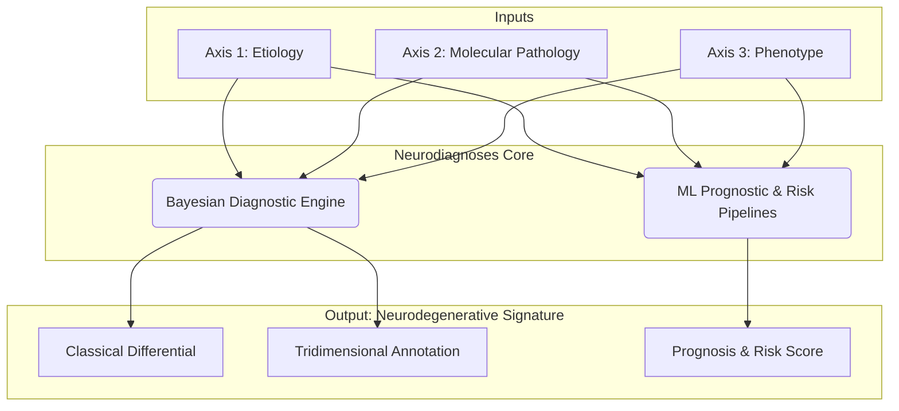

# Neurodiagnoses: An AI-Powered Ecosystem for Neurodegenerative Disorders

**Neurodiagnoses** is an AI-powered, open-source ecosystem designed to integrate multi-modal data and advanced computational models to enhance the diagnostic precision, risk assessment, and prognostic understanding of complex neurodegenerative diseases (NDDs).

> **⚠️ Research Use Only Disclaimer**
> This project is a research prototype and is **NOT a medical device**. It must not be used for clinical diagnosis.

---

## ️ A Dual-System Architecture: Diagnosis & Prognosis

The Neurodiagnoses ecosystem combines a "glass-box" Bayesian engine for deep diagnosis and "black-box" Machine Learning pipelines for prognosis and risk prediction.

> **A detailed technical breakdown of all components is available in the private engine repository:**
> - **[Master Architecture Document](neurodiagnoses-engine/ARCHITECTURE.md)**
> - **[Component Manifest](neurodiagnoses-engine/MANIFEST.md)**
> - **[Operations Playbook](neurodiagnoses-engine/PLAYBOOK.md)**

---
## ⚙️ Getting Started for Developers

... (El resto del README se mantiene sin cambios) ...