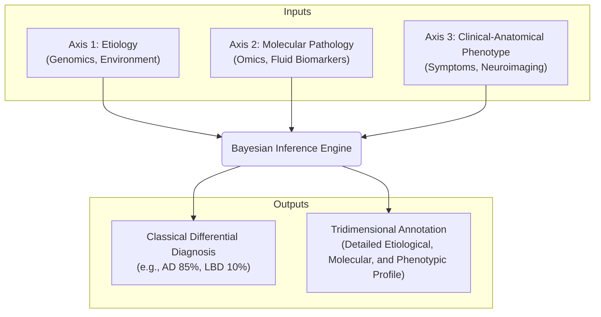

# Neurodiagnoses: An AI-Powered Ecosystem for Neurodegenerative Disorders

**Neurodiagnoses** is an AI-powered, open-source ecosystem designed to integrate multi-modal data and advanced computational models to enhance the diagnostic precision, risk assessment, and prognostic understanding of complex neurodegenerative diseases (NDDs).

This project moves beyond traditional, static disease labels. It generates both a probabilistic differential for classical diagnoses and a rich, **tridimensional diagnostic annotation** that reflects the biological and clinical complexity of each patient, as described in its foundational paper: [Implementing a tridimensional diagnostic framework for personalized medicine in neurodegenerative diseases](https://doi.org/10.1002/alz.14591).

> **⚠️ Research Use Only Disclaimer**
> This entire project, including all models and web interfaces, is a research prototype and is **NOT a medical device**. It has not been validated for clinical use, nor does it have FDA/EMA approval. It **must not** be used for clinical diagnosis or patient management.

---

## ️ Project Vision & High-Level Architecture

The core vision of Neurodiagnoses is to generate a comprehensive **Neurodegenerative Signature** for each patient. This is achieved by processing diverse inputs through a sophisticated Bayesian inference engine to produce a dual output: a classical differential diagnosis and a detailed tridimensional annotation.

Scientific Foundation & Core Architecture
The scientific foundation of Neurodiagnoses is a fully transparent, "glass-box" approach, centered around a probabilistic, evidence-based Bayesian inference engine. This moves away from opaque "black-box" models and allows for a fully traceable and explainable diagnostic process based on our tridimensional framework.

The Three Axes of Diagnosis
Our system organizes all patient data along three fundamental axes:

Axis 1: Etiology: The "Why". Focuses on the root cause or predisposition, including genetic factors (monogenic or risk alleles) and significant environmental or infectious contributors.

Axis 2: Molecular Pathology: The "What". Describes the underlying biological processes. This is the primary axis for multi-omics data, integrating evidence from proteomics, transcriptomics, metabolomics, and fluid biomarkers (CSF/plasma) to profile active pathological pathways like amyloid, tau, synucleinopathy, and neuroinflammation.

Axis 3: Clinical-Anatomical Phenotype: The "How & Where". Captures the observable manifestation of the disease, representing the crucial correlation between clinical symptoms (cognitive scores, neuropsychiatric symptoms) and neuroanatomical findings (structural and functional neuroimaging).

The Dual-Output Engine
The BayesianEngine is the brain of the system. After processing evidence from all three axes, it generates a comprehensive "Neurodegenerative Signature" composed of two parts:

Classical Differential: A familiar, ranked list of classical neurodegenerative diseases, each with a calculated posterior probability.

Tridimensional Annotation: A rich, structured report detailing the patient's profile across the three axes, providing deep insight into the specific mechanisms at play.

⚙️ Getting Started for Developers
This project is developed within GitHub Codespaces to ensure a consistent and reproducible environment.

1. Launch the Environment
Create a new codespace from the repository's main page on GitHub. The new environment will require a one-time setup of the private neurodiagnoses-engine submodule.

2. Install Dependencies
In the Codespace terminal, install the required Python packages:

Bash

pip install -r requirements.txt
3. Launch the Interactive UI
The main entry point to the ecosystem is the Gradio application.

Bash

python app.py
After running the command, navigate to the PORTS tab in your Codespace terminal, find the entry for port 7860, and click the globe icon (🌐) to open the application in your browser.

How to Contribute
This is an open-source project. Please see our CONTRIBUTING.md file for details and explore the open issues. Join our GitHub Discussions to get involved.