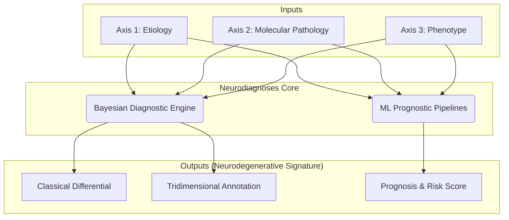

# Neurodiagnoses: An AI-Powered Ecosystem for Neurodegenerative Disorders

[](https://github.com/Fundacion-de-Neurociencias/neurodiagnoses/commits/main)
[](https://github.com/Fundacion-de-Neurociencias/neurodiagnoses/issues)
[](LICENSE)

**Neurodiagnoses** is an AI-powered, open-source ecosystem designed to integrate multi-modal data and advanced computational models to enhance the diagnostic precision, risk assessment, and prognostic understanding of complex neurodegenerative diseases (NDDs).

This project moves beyond traditional, static disease labels. It generates both a probabilistic differential for classical diagnoses and a rich, **tridimensional diagnostic annotation** that reflects the biological and clinical complexity of each patient, as described in its foundational paper: [Implementing a tridimensional diagnostic framework for personalized medicine in neurodegenerative diseases](https://doi.org/10.1002/alz.14591).

> **⚠️ Research Use Only Disclaimer**
> This entire project, including all models and web interfaces, is a research prototype and is **NOT a medical device**. It has not been validated for clinical use, nor does it have FDA/EMA approval. It **must not** be used for clinical diagnosis or patient management.

---

## ️ A Dual-System Architecture: Diagnosis & Prognosis

> **A detailed technical breakdown of all engine and pipeline components is available in the private engine repository.**
> - **[Master Architecture Document](neurodiagnoses-engine/ARCHITECTURE.md)**
> - **[Component Manifest](neurodiagnoses-engine/MANIFEST.md)**
> - **[Operations Playbook](neurodiagnoses-engine/PLAYBOOK.md)**

The Neurodiagnoses ecosystem combines two distinct but complementary computational systems: a "glass-box" Bayesian engine for deep diagnosis and "black-box" Machine Learning pipelines for prognosis and risk prediction.



### 1. The "Glass-Box" Bayesian Diagnostic Engine
This is the reasoning core of the system, responsible for generating the "Firma Neurodegenerativa" (Neurodegenerative Signature).

Function: Performs a diagnostic analysis to explain a patient's current state.

Methodology: It's a transparent, evidence-based system that uses a dynamic Knowledge Base and Bayesian inference to process patient data across our three fundamental axes (Etiology, Molecular Pathology, Phenotype).

Output: Produces the dual-output report containing the classical differential diagnosis and the rich, tridimensional annotation.

### 2. The "Black-Box" Machine Learning Prognostic Pipelines
Rescued and integrated from the project's rich development history, these pipelines are focused on prediction.

Function: Performs a prognostic analysis to predict future outcomes.

Methodology: Utilizes established Machine Learning models (e.g., Cox Proportional Hazards for survival analysis, Polygenic Hazard Scores) trained on large datasets to identify patterns and predict patient trajectories.

Output: Generates risk scores, predicts rates of progression, and estimates future clinical events.

⚙️ Getting Started for Developers
This project is developed within GitHub Codespaces to ensure a consistent and reproducible environment.

1. Launch the Environment
Create a new codespace from the repository's main page on GitHub.

2. Install Dependencies
In the Codespace terminal, install the required Python packages:

```bash
pip install -r requirements.txt
```
3. Launch the Interactive UI
The main entry point to the ecosystem is the Gradio application.

```bash
python app.py
```
After running the command, navigate to the PORTS tab in your Codespace terminal, find the entry for port 7860, and click the globe icon (🌐) to open the application in your browser.

How to Contribute
This is an open-source project. Please see our CONTRIBUTING.md file for details and explore the open issues. Join our GitHub Discussions to get involved.
