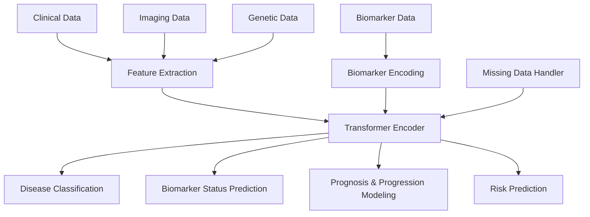

# Neurodiagnoses: An AI-Powered Ecosystem for Neurodegenerative Disorders

[](https://github.com/Fundacion-de-Neurociencias/neurodiagnoses/commits/main)
[](https://github.com/Fundacion-de-Neurociencias/neurodiagnoses/issues)
[](LICENSE)

**Neurodiagnoses** is an AI-powered, open-source ecosystem designed to integrate multi-modal data and advanced computational models to enhance the diagnostic precision, risk assessment, and prognostic understanding of complex neurodegenerative diseases (NDDs).

This project moves beyond traditional, static disease labels towards a **probabilistic, tridimensional diagnostic system** that reflects the biological and clinical complexity of each patient.

> **⚠️ Research Use Only Disclaimer**
> This entire project, including all models and web interfaces, is a research prototype and is **NOT a medical device**. It has not been validated for clinical use, nor does it have FDA/EMA approval. It **must not** be used for clinical diagnosis or patient management.

---

## Live Interactive Demo

The easiest way to interact with the Neurodiagnoses prototype is through our live Gradio application, hosted on Hugging Face Spaces. This interface allows for both single-patient analysis and batch processing of research cohorts.

**➡️ [Launch Interactive Neurodiagnoses App](https://huggingface.co/spaces/fneurociencias/Neurodiagnoses)**

---

## ️ Project Vision & High-Level Architecture

The core vision of Neurodiagnoses is to create a unified, modality-agnostic system capable of learning a deep, disease-agnostic representation of a patient's neurological state. This is achieved by processing diverse inputs through a sophisticated pipeline to generate flexible, clinically relevant outputs.



This architecture processes four key types of data, each providing a unique perspective on the patient's condition:

* **A1 (Clinical Data):** Represents the **observable phenotype** — the symptoms and functional state of the patient (e.g., cognitive scores like MMSE, motor assessments). It answers the question: *"What is the patient experiencing?"*

* **A2 (Imaging Data):** Represents the **structural and functional manifestation** of the disease in the brain (e.g., regional atrophy from MRI, metabolic activity from PET). It answers the question: *"Where is the pathology manifesting?"*

* **A4 (Genetic Data):** Represents the **etiological predisposition** or fundamental cause (e.g., risk alleles like APOE, pathogenic mutations). It answers the question: *"Why might the disease be occurring?"*

* **A3 (Biomarker Data):** This is the bridge between cause and effect. It provides a **direct, real-time measurement of the underlying molecular pathology** (e.g., p-Tau, Aβ42, NfL in CSF or plasma). It answers the question: *"What is the biological process driving the disease right now?"*

The power of Neurodiagnoses lies in its ability to integrate these four distinct but interconnected dimensions into a single, coherent diagnostic and prognostic model.

---

## Scientific Foundation & Core Architecture

The scientific foundation of Neurodiagnoses has evolved towards a fully transparent, "glass-box" approach, centered around a **probabilistic, evidence-based Bayesian inference engine**. This moves away from opaque "black-box" models. The core logic is implemented in `tools/bayesian_engine/core.py`.

### 1. The Knowledge Base: The Source of Truth

The engine is powered by a human-readable and machine-readable Knowledge Base stored in simple CSV files (`data/knowledge_base/`). This KB is populated through a sophisticated, semi-automated pipeline:
- **Vía 1 (Top-Down Synthesis):** An orchestrator (`workflows/knowledge_ingestion/7_knowledge_orchestrator.py`) processes a manifest of scientific topics (`topics.csv`), queries curated evidence sources (e.g., Open Evidence), and uses a Large Language Model (via Groq API) to extract structured "atomic evidence" (`.jsonl`). This is ideal for clinical guidelines and meta-analyses.
- **Vía 2 (Bottom-Up ETL):** For high-throughput granular data (e.g., genetics, imaging atlases), dedicated parsers will ingest information directly from public databases like the GWAS Catalog.

### 2. The Bayesian Engine: The Reasoning Core

The `BayesianEngine` is the brain of the system. Its key features are:
- **Tridimensional Evidence:** It is designed to ingest likelihoods from all three diagnostic axes (Etiology, Molecular, Phenotypic).
- **Iterative Reasoning:** It processes multiple pieces of patient evidence sequentially, updating the diagnostic probability with each new finding.
- **Uncertainty Quantification:** It performs Monte Carlo simulations to calculate not just a single probability, but a **95% Credibility Interval**, providing an honest assessment of the confidence in its own conclusions.

### 3. The Unified Orchestrator

The main application entry point, `unified_orchestrator.py`, has been refactored to integrate the `BayesianEngine`.

---

## Multi-Disease XAI Pipeline and Clinical Dashboard

As part of our goal to build a robust and clinically relevant ecosystem, we have implemented a modular pipeline for analyzing multiple neurodegenerative disorders (NDDs) with a focus on explainability and model governance.

### Workflow Overview

The new workflow is designed to be scalable and transparent:

1.  **Multi-Disease Data Ingestion**: The system now supports multiple disease cohorts (e.g., AD, FTD) by unifying them into a single dataset with a `diagnosis` label (`tools/data_ingestion/unify_multiomics_data.py`).
2.  **Build Feature Sets**:
    ```bash
    python tools/ml_pipelines/build_biomarker_features.py
    ```
3.  **Train Models & Create Cards**:
    ```bash
    python models/train_model.py
    ```
4.  **Launch the Dashboard**:
    ```bash
    python app.py
    ```

### How to Run the New Pipeline

To regenerate all data and models and launch the dashboard, follow these steps from the root directory:

1.  **Unify Data Sources**:
    ```bash
    python tools/data_ingestion/unify_multiomics_data.py
    ```
2.  **Build Feature Sets**:
    ```bash
    python tools/ml_pipelines/build_biomarker_features.py
    ```
3.  **Train Models & Create Cards**:
    ```bash
    python models/train_model.py
    ```
4.  **Launch the Dashboard**:
    ```bash
    python app.py
    ```

---

## ⚙️ Getting Started for Developers
This project is developed within GitHub Codespaces to ensure a consistent and reproducible environment.

1. Launch the Environment
Create a new codespace from the repository's main page on GitHub.

2. Install Dependencies
In the Codespace terminal, install the required Python packages:

```bash
pip install -r requirements.txt
```
3. Run the Full Prototype
To run the complete, end-to-end simulation of the Bayesian inference engine:

```bash
python unified_orchestrator.py
```
4. Launch the Interactive UI
To start the Gradio web application for interactive use:

```bash
python app.py
```
## How to Contribute
This is an open-source project. Please see our CONTRIBUTING.md file for details and explore the open issues. Join our GitHub Discussions to get involved.