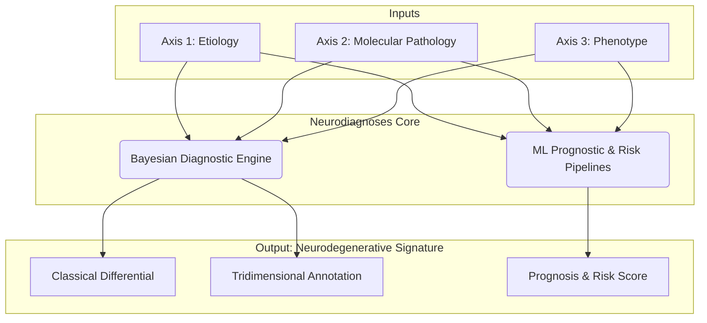

# Neurodiagnoses: An AI-Powered Ecosystem for Neurodegenerative Disorders

> **Visión General y Hoja de Ruta del Proyecto: [Consulta nuestro ROADMAP.md](ROADMAP.md)**

**Neurodiagnoses** is an AI-powered, open-source ecosystem designed to integrate multi-modal data and advanced computational models to enhance the diagnostic precision, risk assessment, and prognostic understanding of complex neurodegenerative diseases (NDDs).

> **⚠️ Research Use Only Disclaimer**
> This project is a research prototype and is **NOT a medical device**. It must not be used for clinical diagnosis.

---

## ️ A Dual-System Architecture: Diagnosis & Prognosis

The Neurodiagnoses ecosystem combines a "glass-box" Bayesian engine for deep diagnosis and "black-box" Machine Learning pipelines for prognosis and risk prediction.

> **A detailed technical breakdown of all components is available in the private engine repository:**
> - **[Master Architecture Document](neurodiagnoses-engine/ARCHITECTURE.md)**
> - **[Component Manifest](neurodiagnoses-engine/MANIFEST.md)**
> - **[Operations Playbook](neurodiagnoses-engine/PLAYBOOK.md)**

⚙️ Getting Started for Developers
This project is developed within GitHub Codespaces to ensure a consistent and reproducible environment.

1. Launch the Environment
Create a new codespace from the repository's main page on GitHub. The new environment will require a one-time setup of the private neurodiagnoses-engine and scikg submodules.

2. Install Dependencies
In the Codespace terminal, install the required Python packages:

Bash

pip install -r requirements.txt
3. Launch the Interactive UI
The main entry point to the ecosystem is the Gradio application.

Bash

python app.py
After running the command, navigate to the PORTS tab in your Codespace terminal, find the entry for port 7860, and click the globe icon (🌐) to open the application in your browser.

How to Contribute
This is an open-source project. Please see our CONTRIBUTING.md file for details and explore the open issues. Join our GitHub Discussions to get involved.
