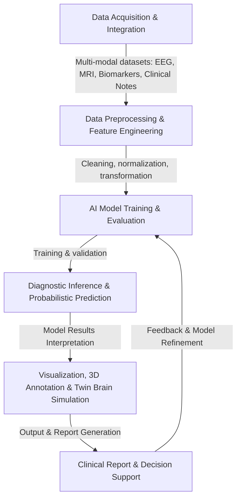

# **🔹 Overview of Neurodiagnoses: Data Integration, Models, and Diagnosis**

## **What is Neurodiagnoses?**
**Neurodiagnoses** is an AI-powered framework that integrates **probabilistic modeling, machine learning, multimodal data (neuroimaging, biomarkers, and clinical data), and language models** to enhance **diagnostic precision and disease progression tracking**.

The project focuses on five core functionalities:
- **Probabilistic Annotation** – AI-based diagnostic modeling using probabilistic networks.
- **Tridimensional Annotation** – Integration of neuroimaging, genetic, and clinical data.
- **Interactive Visualization** – User-friendly interfaces for research and clinical applications.
- **Biomarker Prediction** – AI-driven estimation of biomarker status and progression.
- **Disease Prediction** – Modeling of disease onset, conversion, and progression using ML and language models.

---

## **1️⃣ Data Acquisition and Integration**

**Objective:** Unify multiple data sources for AI-driven neurological diagnosis.

### **Data Sources:**
- **Neuroimaging:** MRI, PET, EEG, acquired from **EBRAINS ([source](https://github.com/Fundacion-de-Neurociencias/neurodiagnoses/blob/main/data_integration/mip_integration.py)), OpenNeuro, and ADNI ([list of databases](https://github.com/Fundacion-de-Neurociencias/neurodiagnoses/blob/main/data/sources/list_of_potential_databases))**.
- **Biomarkers:** Plasma and CSF from **PPMI, GP2, and clinical cohorts ([biomarker integration](https://github.com/Fundacion-de-Neurociencias/neurodiagnoses/blob/main/data_integration/multimodal_biomarker_integration))**.
- **Clinical and Language-based Data:** Structured medical history, electronic records, physician notes, and demographic variables.

### **Integration Infrastructure:**
- **MIP (Milestone Integration Platform) from EBRAINS ([MIP integration](https://github.com/Fundacion-de-Neurociencias/neurodiagnoses/blob/main/data_integration/mip_integration.py))**: Automated clinical data retrieval.
- **DeepPrep ([Neuroimaging Standardization](https://github.com/Fundacion-de-Neurociencias/neurodiagnoses/blob/main/docs/standarization/neuroimaging))**: Neuroimaging preprocessing with artifact correction and segmentation.
- **Clínica.run ([Advanced Neuroimaging Processing](https://github.com/Fundacion-de-Neurociencias/neurodiagnoses/blob/main/docs/standarization/neuroimaging))**: High-performance neuroimaging analysis and computational modeling.
- **Jupyter Notebooks ([Jupyter Integration](https://github.com/Fundacion-de-Neurociencias/neurodiagnoses/blob/main/docs/standarization/flowchart#L2))**: Interactive computing environment for exploratory data analysis and AI modeling.
- **Hugging Face ([Hugging Face Models](https://huggingface.co))**: Hosting machine learning models for neurodiagnostic applications and NLP-based biomarker analysis.
- **InterMine**: Data warehouse for multimodal data integration.
- **BIDS standardization ([BIDS Standardization](https://github.com/Fundacion-de-Neurociencias/neurodiagnoses/blob/main/docs/standarization/neuroimaging))** for improved neuroimaging interoperability.

---

## **2️⃣ Data Preprocessing and Standardization**

**Objective:** Ensure quality and consistency before predictive analysis.

### **Procedures:**
- **Neuroimaging:** Segmentation, normalization, and registration to standard space (**MNI, FreeSurfer, ANTs**).
- **EEG:** Noise filtering, feature extraction (**MNE-Python, NeuroKit2**).
- **Biomarkers:** Cleaning and normalization for consistent clinical data.
- **Text and Clinical Notes:** NLP preprocessing using **Hugging Face Transformers** for medical document analysis and automated extraction of diagnostic indicators.

---

## **3️⃣ Predictive Modeling and Probabilistic Diagnosis**

**Objective:** Utilize AI to extract patterns and generate diagnostic inferences.

### **Implemented Models:**
- **CNNs and Autoencoders:** Feature extraction from MRI and PET.
- **Random Forest and SHAP ([Biomarker Prediction](https://github.com/Fundacion-de-Neurociencias/neurodiagnoses/blob/main/docs/standarization/biomarker_and_disease_prediction))**: Identifying the most relevant biomarkers.
- **Transformers for EEG and Language Models:** Deep learning models for brain connectivity analysis and **clinical text-based diagnosis using Hugging Face NLP models**.
- **Twin Brain Modeling with TVB:** Creating personalized neurodegenerative progression models.

### **Evaluation and Validation:**
- **Subject-level cross-validation** to prevent bias.
- **Performance metrics:** AUC, sensitivity, specificity, and F1-score.

---

## **4️⃣ Interpretability, Visualization, and 3D Diagnostic Annotation**

**Objective:** Provide comprehensible interpretations, personalized simulations, and detailed spatial diagnostic annotation.

### **Visualization and Interpretation:**
- **Heatmaps on neuroimaging** to highlight affected brain regions.
- **Explainability with SHAP and LIME** to interpret ML models.
- **Interactive diagnostic panels** integrated into Hugging Face Spaces.

### **3D Diagnostic Annotation:**
- **Integration with Neurodiagnoses 3D diagnostic framework ([3D annotation workflow](https://github.com/Fundacion-de-Neurociencias/neurodiagnoses/blob/main/docs/diagnosis_workflow.md))**.
- **Mapping of affected brain regions** based on probabilistic AI-based classifications.
- **Overlaying MRI, PET, and EEG data** into 3D anatomical structures for precise localization of pathological findings.

### **Twin Brain Simulation:**
- **TVB (The Virtual Brain):** Personalized simulation of functional and structural connectivity.
- **Evaluation of therapeutic interventions** in digital twin models.

---

## **5️⃣ Report Generation and Clinical Support**

**Objective:** Generate AI-based clinical reports for diagnostic assistance.

### **Workflow:**
1. **Results Compilation:** AI models generate probabilistic diagnoses.
2. **Conversion to Clinical Report:** A structured report is generated with management recommendations.
3. **Medical Decision Support:** Interactive platform to assess clinical scenarios.

---

# **🔹 Conclusion: Integrated Neurodiagnoses Infrastructure**
✅ **Neurodiagnoses integrates multiple data sources, advanced AI models, Hugging Face NLP tools, and simulation frameworks to enhance neurological diagnosis.**
✅ **The infrastructure is based on GitHub, EBRAINS, Clínica.run, Hugging Face, and 3D visualization platforms for interactive analysis.**
✅ **The workflow is modular, allowing real-time iterations and improvements.**

📌 **Next Steps:** Detailed GitHub documentation and automation of integration pipelines.

---

## **🔹 Visual Workflow Diagram**

This diagram illustrates the **end-to-end workflow of Neurodiagnoses**, integrating **Clínica.run for advanced neuroimaging processing**, **Hugging Face NLP models**, **machine learning**, and **multimodal diagnostics**, from data acquisition to clinical decision support.

